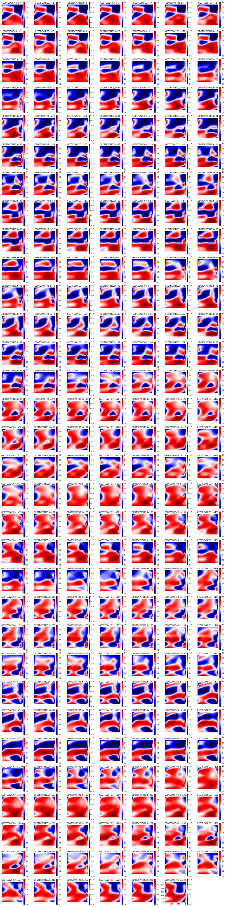

# cGAN data augmentation for indoor positioning

En la era actual de la conectividad inalámbrica, el uso de tecnologías basadas en WiFi se ha convertido en un componente esencial de nuestras vidas cotidianas. La ubicación y la geolocalización son factores críticos para una amplia gama de aplicaciones, desde la navegación en interiores hasta la optimización de la logística en almacenes inteligentes. Una de las técnicas más comunes para estimar la posición en entornos interiores se basa en el uso del "Fingerprinting" del WiFi, que implica la creación de una base de datos de señales RSSI (Received Signal Strength Indicator) en puntos de referencia conocidos. Sin embargo, la creación y el mantenimiento de estas bases de datos puede ser un proceso costoso y laborioso.

El presente Trabajo de Fin de Máster (TFM) se enfoca en abordar este desafío al aplicar Generative Adversarial Networks condicionales (cGANs) para aumentar una base de datos de señales RSSI obtenidas a través de la aplicación "get_sensordata". Esta aplicación recopila información de señales WiFi en entornos específicos y constituye una herramienta valiosa para la recopilación de datos de entrenamiento para sistemas de posicionamiento basados en huellas digitales de WiFi.

El objetivo fundamental de este TFM es mejorar las técnicas de estimación de posición en entornos interiores mediante la expansión de la base de datos de señales RSSI a través de la generación sintética de datos utilizando cGANs. La aplicación de GANs condicionales permitirá generar datos RSSI adicionales que se asemejen a los recopilados en el mundo real, lo que a su vez mejorará la precisión y la robustez de los sistemas de posicionamiento basados en huellas digitales de WiFi.

Este trabajo se estructura en torno a la investigación, el diseño, la implementación y la evaluación de un sistema que integra cGANs para aumentar la base de datos de señales RSSI y, finalmente, mejorar las técnicas de estimación de posición en interiores. Se llevará a cabo una revisión exhaustiva de la literatura relacionada, se presentará una metodología de trabajo detallada y se realizarán experimentos para evaluar la eficacia de la técnica propuesta.

Con el crecimiento continuo de la Internet de las cosas (IoT) y la necesidad de sistemas de posicionamiento precisos en entornos interiores, este TFM se presenta como una contribución significativa al campo de la geolocalización basada en WiFi, al abordar la problemática de la expansión de las bases de datos RSSI de manera innovadora y efectiva.

A lo largo de las próximas secciones, se detallarán los aspectos metodológicos, los resultados obtenidos y las conclusiones derivadas de esta investigación.

## Preprocesamiento de los datos

Los datos obtenidos con la aplicación de **get_sensordata** se encuentran en el directorio *data/raw_groundtruth*.

El script **process_groundTruth.py** se encarga de procesar los datos en bruto, limpiarlos y exportalos en la ruta *data/final_groundtruth*

## Carga de los datos

Para cargar los datos, se ha definido una clase **DataLoader** dentro del directorio **src**. Esta clase se encarga de cargar los datos, procesarlos y devolverlos en formato *numpy array*.

Una de las operaciones realizadas en los datos como preprocesamiento consiste en generar los mapas de reference points continuos desde los mapas discretos. Para ello:

1) Se leen el fichero de datos **groundtruth.csv**
2) Para cada AP se genera un mapa de puntos de referencia continuos de la siguiente forma:
   1) Para cada batch temporal de datos, se calcula la media de las señales RSSI del AP en cada Reference Point
   2) Se interpola la señal RSSI en cada Reference Point para obtener un mapa continuo, con RSS para todo punto (latitud, longitud) del mapa
   3) Se interpolan datos ausentes resultado de la interpolación anterior


Imagen izquierda: Media RSS de una AP en todo un intervalo temporal para cada punto discreto anotado (Latitud, Longitud). Imagen central: Interpolación valores RSS para todo punto (latitud, longitud). Imagen derecha: Interpolación valores ausentes de la interpolación anterior

Todas estas operaciones las ejecuta el **DataLoader** utilizando la función **referencePointMap**

```python
from src import dataloader
from src import constants

X, y = dataloader.DataLoader(data_dir=f"{constants.data.FINAL_PATH}/groundtruth.csv",
                             aps_list=constants.aps, batch_size=30, step_size=5,
                             size_reference_point_map=300,
                             return_axis_coords=False)()
```


## Herramientas de visualización

Para visualizar los datos, se han implementado una serie de funciones en el script **src/imutils.py**:
<ul>
    <li><b>plotAllAP</b> Muestra y guarda la imagen del mapa continuo de RP para cada instante temporal</li>
    <li><b>save_ap_gif</b> Guarda un gif con la evolución temporal del mapa continuo de RP</li>
    <li><b>displayGif</b> Muestra en el notebook el gif</li>
</ul>


```python
from src import dataloader
from src import constants
from src import imutils

X, y, _ = dataloader.DataLoader(data_dir=f"{constants.data.FINAL_PATH}/groundtruth.csv",
                                                   aps_list=constants.aps, batch_size=30, step_size=5,
                                                   size_reference_point_map=300,
                                                   return_axis_coords=False)()
RPMap, APLabel = X[:,:,:,0], y[:,0]

# Si queremos solamente mostrar el mapa de un AP sin guardar la imagen
imutils.plotAllAp(reference_point_map = RPMap, labels = APLabel, aps_list = constants.aps,
                  save_ok = False, plot_ok = True)
```

Se visualizaría la siguiente imagen:




Si queremos guardar el gif con la evolución temporal del mapa de un AP:


```python
X, y, [x_coords, y_coords] = dataloader.DataLoader(data_dir=f"{constants.data.FINAL_PATH}/groundtruth.csv",
                                                   aps_list=constants.aps, batch_size=30, step_size=5,
                                                   size_reference_point_map=300,
                                                   return_axis_coords=False)()
RPMap, APLabel = X[:,:,:,0], y[:,0]
imutils.save_ap_gif(reference_point_map = RPMap, x_g = x_coords, y_g = y_coords, aps_list = constants.aps,
                    reduced = False, path="gifs")

imutils.displayGif("gifs/GEOTECWIFI03.gif")
```

Se visualizaría el siguiente gif:


## Entrenamiento de cGAN para aumento de datos

Para entrenar el modelo, ya se encuentra definido el tipo de modelo cGAN a utilizar dentro de **models**. Además, se encuentran definidos una serie de **callbacks**
 customizados para utilizar en el proceso de entrenamiento de la cGAN dentro del mismo directorio. Entre ellos tenemos definido:

<ul>
    <li><b>SaveImageTraining:</b> Guarda la imagen real, la imagen generada y el histograma de la imagen generada tras cada época </li>
    <li><b>LoggingCheckpointTraining:</b> Guarda el modelo en formato .h5 cada 10 épocas</li>
</ul>

```python
import tf

# Importación del modelo cGAN
from models.cGAN_300_300 import cGAN
# uso de callbacks definidas para la cGAN
from models.callbacks import SaveImageTraining, LoggingCheckpointTraining

# Definición del discriminador y el generador
def define_discriminator():
    ....

def define_generator(latent_dim):
    ....

discriminator = define_discriminator()
generator = define_generator(latent_dim=100)

# definición del dataset
dataset = tf.data.Dataset.from_tensor_slices((X, y)).shuffle(1000).batch(8)

# definición de callbacks
path_images_training = f"{constants.outputs.models.cgan_300}/training_images"
path_checkpoints = f"{constants.outputs.models.cgan_300}/checkpoints"
save_image = SaveImageTraining(X, y, save_dir=path_images_training)
save_model = LoggingCheckpointTraining(save_dir=path_checkpoints)

# Entrenamiento del modelo
cgan = cGAN(generator=generator, discriminator=discriminator)
cgan.fit(dataset, epochs=50, callbacks = [save_image, save_model])
```

El proceso de entrenamiento lo podemos representar en un gif animado como sigue:


## Datos

Se realizó una recogida de datos en el edificio de espaitec en el Instituto de las Nuevas Tecnologías de la Imagen (INIT), en la Universitat de Jaume I. Se recogieron datos utilizando 7 APs en 23 puntos de referencia de la misma sala para el conjunto de entrenamiento. Los datos se recogieron y 17 puntos de referencia para el conjunto de test.

Para el conjunto de entrenamiento, en cada uno de los 23 Reference Points, se recogieron 1140 segundos de datos, mientras que con el conjunto de test se recogieron 60 segundos de datos en los 17 reference points, cada uno con unas coordenadas (longitud, latitud) distintas que en el conjunto de entrenamiento.

Podemos ver la representación de los puntos de referencia de entrenamiento y los puntos de referencia de test en la siguiente imagen:


