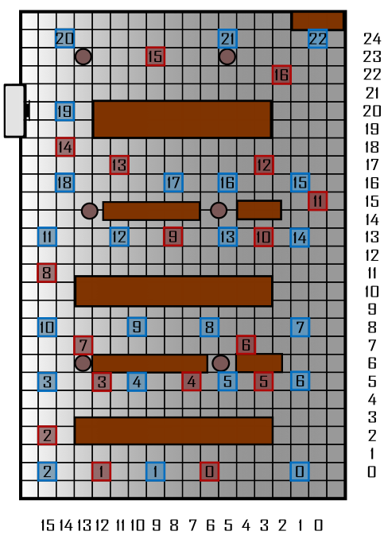
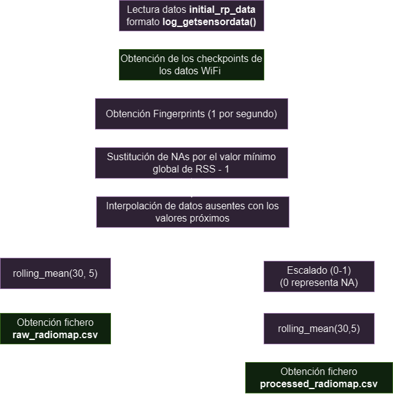

# Generative AI Applied to Improve Position Estimation

In the current era of wireless connectivity, the ubiquity of WiFi-based technologies has become integral to our daily lives. Location and geolocation play pivotal roles in numerous applications, ranging from indoor navigation to optimizing logistics in smart warehouses. WiFi Fingerprinting is a prevalent technique for estimating position in indoor environments, involving the creation of a database of Received Signal Strength Indicator (RSSI) signals at known reference points. However, the creation and maintenance of these databases can be resource-intensive.

This project addresses this challenge by employing conditional Generative Adversarial Networks (cGANs) to augment an RSSI signal database obtained through the "get_sensordata" application. This application collects WiFi signal information in specific environments, serving as a valuable tool for gathering training data for WiFi fingerprint-based positioning systems.

The primary objective is to enhance indoor position estimation techniques by expanding the RSSI signal database through the synthetic generation of data using cGANs. The application of conditional GANs enables the generation of additional RSSI data that closely resembles real-world collected data, thereby improving the accuracy and robustness of WiFi fingerprint-based positioning systems.

This work involves research, design, implementation, and evaluation of a system that integrates cGANs to augment the RSSI signal database and enhance indoor position estimation techniques. A comprehensive review of related literature will be conducted, a detailed work methodology will be presented, and experiments will be carried out to assess the effectiveness of the proposed technique.

With the continued growth of the Internet of Things (IoT) and the increasing demand for precise positioning systems in indoor environments, this project contributes significantly to the field of WiFi-based geolocation by addressing the challenge of innovatively and effectively expanding RSSI databases.

## Project Structure

La estructura entera del proyecto se basa en 4 directorios principales:

<ul>
    <li><b>data:</b> Directorio en la que se encuentran tanto los datos obtenidos usando la aplicación <b>get_sensordata</b>, como los datos preprocesados</li>
    <li><b>info:</b> Directorio en el que se encuentran los ficheros de información del proyecto:</li>
    <ul>
        <li><b>coordenadas_train.csv:</b> Fichero con las coordenadas usadas en cada punto de referencia de Train</li>
        <li><b>coordenadas_test.csv:</b> Fichero con las coordenadas usadas en cada punto de referencia de Test</li>
        <li><b>mapa_plano.png:</b> Mapa del plano en la recogida de datos, indicando la posición de cada punto de referencia, tanto en entrenamiento como en test</li>
        <li><b>Documentación del proyecto.docx:</b> Word con documentación adicional del proyecto</li>
    </ul>
    <li><b>outputs:</b> Directorio en el que se encuentran todas las salidas del proyecto:</li>
    <ul>
        <li>Imágenes</li>
        <li>Gifs</li>
        <li>Checkpoints de modelos</li>
        <li>Tablas con métricas</li>
        <li>...</li>
    </ul>
    <li><b>src: </b> Directorio con el código fuente de todo el proyecto, hecho para realizar las ejecuciones necesarias de forma modular. Dentro de este directorio se encuentran todos los <b>scripts.py</b> que ejecutan alguna acción determinada en un proceso: <b>process_train.py</b>, <b>process_test.py</b>  <b>process_partitions.py</b> y <b>positioning_partitions.py</b>.
        Además, en el módulo <b>utils</b> se encuentran definidos las constantes, los métodos y las clases fundamentales para el desarrollo de todo el proyecto.</li>
</ul>

Los principales scripts implementados para la ejecución del proyecto son:
<li><b>obtainDataINITandPositioning.py: </b> Está diseñado para ejecutarse del siguiente modo en la terminal:</li>

```python
python obtainDataINITandPositioning.py 
```

Este script se encargará de procesar los datos de entrenamiento, de test, crear las particiones de datos de entrenamiento y test utilizando los datos de entrenamiento, y de aplicar la estimación de la posición con las particiones. Devolviendo así la tabla de métricas, la tabla de métricas para cada coordenada y gráficas de error de posicionamiento


## Datos del proyecto, preprocesado y estructuración

</img>

Los datos se han recogido manualmente utilizando la aplicación <b>get_sensordata</b> en el edificio del INIT.
La imagen de arriba muestra un mapa de la planta y de la localización de los distintos puntos de referencia de datos. El color azul representa los puntos de Train, mientras que el color rojo representa los puntos de Test.

Se genera un fichero por cada punto de referencia y, una vez recogidos los datos con algún dispositivo Android (móvil, Tablet, ...), <u> se traspasan manualmente</u> al siguiente directorio (en train y en test):

```python
data
├── train
│   ├── initial_rp_data (TRAIN DATA)
│
├── test
│   ├── initial_rp_data (TEST DATA)
```

Si consideramos que cada baldosa, representada en las rejillas grises de la imagen, mide 60 centímetros, entonces realizamos una transformación de coordenadas ficticias (baldosas) a coordenadas longitud, latitd (metros). La tabla de coordenadas la podemos visualizar en las siguientes tablas:

<table>
    <caption>Tabla de puntos de referencia de TRAIN</caption>
    <tr>
        <th>Label</th>
        <th>Longitud</th>
        <th>Latitud</th>
    </tr>
    <tr>
        <td>0</td>
        <td>0.6</td>
        <td>0</td> 
    </tr>
    <tr>
        <td>1</td>
        <td>5.4</td>
        <td>0</td>
    </tr>
    <tr>
        <td>2</td>
        <td>9</td>
        <td>0</td>
    </tr>
    <tr>
        <td>3</td>
        <td>9</td>
        <td>3</td>
    </tr>
    <tr>
        <td>4</td>
        <td>6</td>
        <td>3</td>
    </tr>
    <tr>
        <td>5</td>
        <td>3</td>
        <td>3</td>
    </tr>
    <tr>
        <td>6</td>
        <td>0.6</td>
        <td>3</td>
    </tr>
    <tr>
        <td>7</td>
        <td>0.6</td>
        <td>4.8</td>
    </tr>
    <tr>
        <td>8</td>
        <td>3.6</td>
        <td>4.8</td>
    </tr>
    <tr>
        <td>9</td>
        <td>6</td>
        <td>4.8</td>
    </tr>
    <tr>
        <td>10</td>
        <td>9</td>
        <td>4.8</td>
    </tr>
    <tr>
        <td>11</td>
        <td>9</td>
        <td>7.8</td>
    </tr>
    <tr>
        <td>12</td>
        <td>0.6</td>
        <td>7.8</td>
    </tr>
    <tr>
        <td>13</td>
        <td>3</td>
        <td>7.8</td>
    </tr>
    <tr>
        <td>14</td>
        <td>0.6</td>
        <td>7.8</td>
    </tr>
    <tr>
        <td>15</td>
        <td>0.6</td>
        <td>9.6</td>
    </tr>
    <tr>
        <td>16</td>
        <td>3</td>
        <td>9.6</td>
    </tr>
    <tr>
        <td>17</td>
        <td>4.8</td>
        <td>9.6</td>
    </tr>
    <tr>
        <td>18</td>
        <td>8.4</td>
        <td>9.6</td>
    </tr>
    <tr>
        <td>19</td>
        <td>8.4</td>
        <td>12</td>
    </tr>
    <tr>
        <td>20</td>
        <td>8.4</td>
        <td>14.4</td>
    </tr>
    <tr>
        <td>21</td>
        <td>3</td>
        <td>14.4</td>
    </tr>
    <tr>
        <td>22</td>
        <td>0</td>
        <td>14.4</td>
</table>

Dentro del directorio <b>src</b>, tenemos dos scripts de Python: process_train.py y process_test.py. La ejecución de cada uno de estos scripts (desde el script del directorio principal: <b>obtainDataINITandPositioning.py</b>) nos va a realizar todo el preprocesado necesario para obtener el radiomap preparado para el entrenamiento de los modelos de posicionamiento.

La ejecución de estos scripts nos proporcionará el siguiente directorio de salida:
(nuevos ficheros y directorios marcados con dos asteriscos)

```python
data
|----train
|	|---- initial_rp_data
|	|---- checkpoint_groundtruth **
|	|---- raw_radiomap **
|	|	|---- raw_radiomap.csv **
|	|---- processed_radiomap **
|	|	|----- processed_radiomap.csv **
|	
|---- test
|	|---- initial_rp_data
|	|---- checkpoint_groundtruth **
|	|---- raw_radiomap **
|	|	|---- raw_radiomap.csv **
|	|---- processed_radiomap **
|	|	|----- processed_radiomap.csv **
```

Donde <b>raw_radiomap.csv</b> corresponde con el radiomap sin escalado de los datos, por lo que se presenta en unidades (decibelios), mientras que <b>processed_radiomap.csv</b> presenta los niveles de RSS escalados entre 0 y 1.

Los scripts de preprocesado, dependen directamente de los métodos implementados en los scripts <b>preprocess.py</b> y <b>constants.py</b> que se encuentran en el directorio <b>src/utils</b>

```python
root
|
|----data
|
|---- src
|      |---- models
|      |---- positioning
|      |---- utils
|      |       |---- preprocess.py
|      |       |---- constants.py
|      |
|      |---- process_train.py
|      |---- process_test.py
|      |---- process_partitions.py
|      |---- positioning_partitions.py
|
|---- obtainDataINITandPositioning.py

```
Dentro de las constantes, en el script constants.py, es importante definir las siguientes de manera correcta, y adecuado para el sistema de directorios en el trabajo, para que el preprocesado se realice de manera correcta:

<b>constants.data.train.INITIAL_DATA:</b> dirección de los datos iniciales de entrenamiento.
<b>constants.data.train.CHECKPOINT_DATA_PATH:</b> dirección de los checkpoints de los datos de entrenamiento.
<b>constants.data.train.RAW_OUT_PATH:</b> dirección del radiomap en bruto de entrenamiento.
<b>constants.data.train.PROC_OUT_PATH:</b> dirección del radiomap escalado de entrenamiento.
<b>constants.data.train.INITIAL_DATA:</b> dirección de los datos iniciales de test.
<b>constants.data.train.CHECKPOINT_DATA_PATH:</b> dirección de los checkpoints de los datos de test.
<b>constants.data.train.RAW_OUT_PATH:</b> dirección del radiomap en bruto de test.
<b>constants.data.train.PROC_OUT_PATH:</b> dirección del radiomap escalado de test.<br>
<b>constants.aps:</b> lista con los puntos de acceso WiFi a considerar para la obtención del fingerprint.<br>
<b>constants.labels_dictionary_meters:</b> diccionario que transforma de label a coordenadas en entrenamiento.<br>
<b>constants.labels_dictionary_meters_test:</b> diccionario que transforma de label a coordenadas en test.<br>
<b>constants.labels_train:</b> lista con las labels (puntos de acceso) a considerar en entrenamiento.<br>
<b>constants.labels_test:</b> lista con las labels (puntos de acceso) a considerar en test.<br>
<b>constants.T_MAX_SAMPLING:</b> tiempo máximo (en segundos) de muestreo en cada label de entrenamiento.
<b>constants.T_MAX_SAMPLING_TEST:</b> tiempo máximo (en segundos) de muestreo en cada label de test.


Por último, haciendo uso de los métodos descritos en <b>preprocess.py</b>, al ejecutar los scripts <b>process_train.py</b> y <b>process_test.py</b>. El flujo de ejecución será el siguiente:

</img>

El proceso se resume en lo siguiente:
Se procesan los ficheros log de <b>get_sensordata</b>, para transformarlos a un formato en el que cada fila representa el fingerprint de un segundo, como la media de todas las observaciones en ese periodo de RSS para cada AP.
Posteriormente, se cambian los NAs resultantes por el valor mínimo global – 1, esto se hace para que posteriormente, con el escalado, el 0 represente ausencia de RSS.
También se aplica un promediado móvil en ventanas de 30 segundos con un overlapping de 5 segundos, de este modo, suavizamos los valores obtenidos en el RSS. 
Finalmente, se obtiene el fichero de <b>raw_radiomap.csv</b> (sin escalado), y <b>processed_radiomap.csv</b> (con escalado)


## Datos de particiones en Train 

También se ha planteado en el proyecto, para probar otras alternativas, ha realizar varias particiones de train y de test con los mismos datos recogidos en train, para poder estudiar los efectos en recogidas de datos de tiempos similares.
Para ello, se ha implementado el script process_partitions.py. El objetivo de este script será obtener el siguiente directorio de salida aplicando los mismos pasos de preprocesado que en el caso de train, pero con puntos de referencia distintos.
El script devuelve el siguiente directorio:

```python
data
|----train
|---- test
|---- partitions **
|	      |---- partition_5vs18
|	      |		   |---- train
|	      |		   |       |---- raw
|	      |		   |       |	  |---- raw_radiomap.csv
|	      |		   |       |---- processed
|	      |		   |       |	  |---- processed_radiomap.csv
|	      |		   |       |	  |
|	      |	   	   |---- test
|	      |		   |       |---- raw
|	      |	   	   |       |	  |---- raw_radiomap.csv
|	      |	   	   |       |---- processed
|	      |	   	   |       |	  |---- processed_radiomap.csv
|	      |---- partition_10vs13
|	      |	   	   |---- train
|	      |	   	   |       |---- raw
|	      |	   	   |       |      |---- raw_radiomap.csv
|	      |	   	   |       |---- processed
|	      |	   	   |       |	  |---- processed_radiomap.csv
|	      |	   	   |       |	  |
|	      |	   	   |---- test
|	      |	   	   |       |---- raw
|	      |	   	   |       |	  |---- raw_radiomap.csv
|	      |	   	   |       |---- processed
|	      |	   	   |       |	  |---- processed_radiomap.csv
|	      |---- partition_15vs8
|	      |	   	   |---- train
|	      |	   	   |       |---- raw
|	      |	   	   |       |	  |---- raw_radiomap.csv
|	      |	   	   |       |---- processed
|	      |	   	   |       |	  |---- processed_radiomap.csv
|	      |	   	   |       |	  |
|	      |	   	   |---- test
|	      |	   	   |       |---- raw
|	      |	   	   |       |	  |---- raw_radiomap.csv
|	      |	   	   |       |---- processed
|	      |	   	   |       |	  |---- processed_radiomap.csv
```

En este paso se han planteado 3 alternativas con los datos de train, representadas en la siguiente tabla:

<table class="default">
  <colgroup>
  <colgroup>
  <colgroup>
  <tr>
    <th>Partition</th>
    <th>Set</th>
    <th>Reference Points associated</th>
  </tr>
  <tr>
    <th rowspan="2">Partition 5 Train over 18 Test</th>
    <td>Train</td>
    <td>0, 2, 11, 14, 21</td>
  </tr>
  <tr>
    <td>Test</td>
    <td>1, 3, 4, 5, 6, 7, 8, 9, 10, 12, 13, 15, 16, 17, 18, 19, 20, 22</td>
  </tr>
    <tr>
        <th rowspan="2">Partition 10 Train over 13 Test</th>
        <td>Train</td>
        <td>0, 2, 3, 5, 9, 13, 19, 22</td>
    </tr>
    <tr>
        <td>Test</td>
        <td>1, 4, 6, 7, 8, 10, 11, 12, 14, 15, 16, 17, 18, 20, 21</td>
    </tr>
    <tr>
        <th rowspan="2">Partition 15 Train over 8 Test</th>
        <td>Train</td>
        <td> 0, 2, 4, 5, 7, 9, 10, 11, 14, 15, 17, 18, 20, 21, 22 </td>
    </tr>
    <tr>
        <td>Test</td>
        <td>1, 3, 6, 8, 12, 13, 16, 19</td>
    </tr>
</table>

Para el correcto funcionamiento del script process_partitions.py. Hay que asegurarse que las siguientes constantes en <b>src/utils/constants.py</b> estén correctamente definidas:

<b>constants.labels_partition_5vs18:</b> lista con puntos de referencia de train a usar en la partición 5 vs 18 <br>
<b>constants.labels_partition_10vs13:</b> lista con puntos de referencia de train a usar en la partición 10 vs 13 <br>
<b>constants.labels_partition_15vs8:</b> lista con puntos de referencia de train a usar en la partición 15 vs 8 <br>
<b>constants.data.partitions.PARTITION_5VS18:</b> directorio de salida de la partición 5 vs 18 <br>
<b>constants.data.partitions.PARTITION_10VS13:</b> directorio de salida de la partición 10 vs 13 <br>
<b>constants.data.partitions.PARTITION_15VS8:</b> directorio de salida de la partición 15 vs 8 <br>

## Estimación de la posición

Para la estimación de la posición, se ha implementado el script <b>positioning_partitions.py</b>, dentro del directorio <b>src</b>.
Este script se encarga de realizar la estimación de la posición en cada una de las particiones de train, y de devolver las tablas de métricas y las gráficas de error de posicionamiento en el directorio <b> outputs/positioning_partitions</b>.

```python
root
|
|----data
|
|---- src
|    
|---- outputs 
|      |---- positioning_partitions **
|      |       |---- tablas **
|      |       |       |---- tabla_metricas.csv **
|      |       |       |---- tabla_metricas_per_coord.csv **
|      |       |       
|      |       |---- plots **
|      |               |---- barplot metrics.png **
|      |               |---- errorbar metrics.png **
```

Una vez ejecutamos el script, obtenemos en el directorio <b>outputs/positioning_partitions/plots</b> las siguientes gráficas que definen el error obtenido en la estimación de la posición:

</img>
</img>


La primera gráfica nos muestra el error de posicionamiento para cada modelo en cada coordenada, ordenado de menor a mayor según el error. Para ello, se ha empleado en este caso los modelos kNN(K=1), KNN(K=5) y RF(n_estimators=500), representados con los colores naranja, verde y morado respectivamente. Realizamos esta gráfica para mostrar el error de posicionamiento en cada partición del estudio, y así poder comparar los resultados obtenidos en cada una de ellas. Para cada punto, tenemos representado la media (punto con color) y la desviación típica (barra vertical) del error de posicionamiento en cada partición.

Por otro lado, la segunda gráfica nos muestra el error en una gráfica de barras para cada modelo y partición. En este caso, se ha representado el error medio de posicionamiento para cada modelo en cada partición, y se ha representado la desviación típica del error de posicionamiento en cada partición. De este modo, podemos comparar el error de posicionamiento medio de cada modelo de cada partición.
