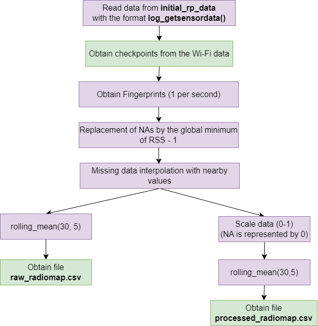
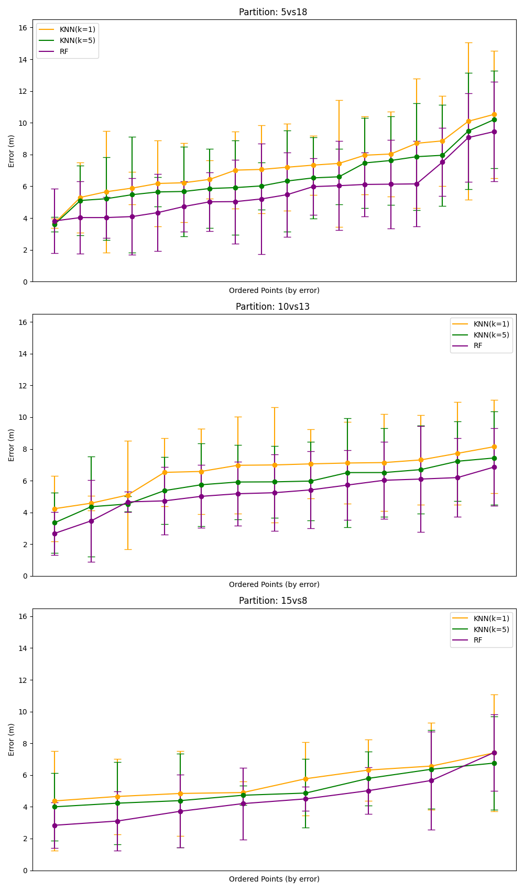

# Generative AI Applied to Improve Position Estimation

In the current era of wireless connectivity, the ubiquity of WiFi-based technologies has become integral to our daily lives. Location and geolocation play pivotal roles in numerous applications, ranging from indoor navigation to optimizing logistics in smart warehouses. WiFi Fingerprinting is a prevalent technique for estimating position in indoor environments, involving the creation of a database of Received Signal Strength Indicator (RSSI) signals at known reference points. However, the creation and maintenance of these databases can be resource-intensive.

This project addresses this challenge by employing conditional Generative Adversarial Networks (cGANs) to augment an RSSI signal database obtained through the "get_sensordata" application. This application collects WiFi signal information in specific environments, serving as a valuable tool for gathering training data for WiFi fingerprint-based positioning systems.

The primary objective is to enhance indoor position estimation techniques by expanding the RSSI signal database through the synthetic generation of data using cGANs. The application of conditional GANs enables the generation of additional RSSI data that closely resembles real-world collected data, thereby improving the accuracy and robustness of WiFi fingerprint-based positioning systems.

This work involves research, design, implementation, and evaluation of a system that integrates cGANs to augment the RSSI signal database and enhance indoor position estimation techniques. A comprehensive review of related literature will be conducted, a detailed work methodology will be presented, and experiments will be carried out to assess the effectiveness of the proposed technique.

With the continued growth of the Internet of Things (IoT) and the increasing demand for precise positioning systems in indoor environments, this project contributes significantly to the field of WiFi-based geolocation by addressing the challenge of innovatively and effectively expanding RSSI databases.

## Project Structure

The entire structure of the project is based on 4 main directories:

<ul>
    <li><b>data:</b> Directory where the data obtained using the application <b>get_sensordata</b> is located</li>
    <li><b>info:</b> Directory where project information files are stored:</li>
    <ul>
        <li><b>train_coordinates.csv:</b> File with the coordinates used at each reference point for training</li>
        <li><b>test_coordinates.csv:</b> File with the coordinates used at each reference point for testing</li>
        <li><b>plane_of_data.png:</b> Map of the data collection plane, indicating the position of each reference point in both training and testing</li>
        <li><b>preprocessing_workflow.png:</b> Flowchart of the preprocessing process</li>
        <li><b>Project documentation.docx:</b> Word document with additional project documentation</li>
    </ul>
    <li><b>outputs:</b> Directory where all project outputs are stored:</li>
    <ul>
        <li>Preprocessed data</li>
        <li>Images</li>
        <li>Gifs</li>
        <li>Model Checkpoints</li>
        <li>Metric Tables</li>
        <li>...</li>
    </ul>
    <li><b>src: </b> Directory with the source code for the entire project, designed for modular execution. Within this directory, all <b>scripts.py</b> files that perform specific actions in a process are located, such as <b>process_train.py</b>, <b>process_test.py</b>, <b>process_partitions.py</b>, and <b>positioning_partitions.py</b>.
        Additionally, in the <b>utils</b> module, constants, methods, and fundamental classes for the development of the entire project are defined.</li>
</ul>

The main scripts implemented for the project execution are:

<li><b>obtainDataINITandPositioning.py: </b>Designed to be executed in the terminal in the following way:</li>

```python
python obtainDataINITandPositioning.py 
```

This script will be responsible for processing the training and test data, creating training and test data partitions using the training data, and applying position estimation with the partitions. It will thus return the metric table, the metric table for each coordinate, and positioning error graphs

## Project Data, Preprocessing, and Structuring

</img>

The data has been manually collected using the <b>get_sensordata</b> application in the INIT building.
The image above shows a map of the floor and the location of various data reference points. The blue color represents Train points, while the red color represents Test points.

A file is generated for each reference point, and once the data is collected using an Android device (mobile, tablet, ...), <u>it is manually transferred</u> to the following directory (in both train and test):


```python
data
├── train
│   ├── initial_rp_data (TRAIN DATA)
│
├── test
│   ├── initial_rp_data (TEST DATA)
```

If we consider that each tile, represented by the gray grids in the image, measures 60 centimeters, then we perform a transformation from fictitious tile coordinates to longitude and latitude coordinates (meters). The coordinate table can be visualized in the following tables:

<table>
    <caption>Reference points table of TRAIN</caption>
    <tr>
        <th>Label</th>
        <th>Longitude</th>
        <th>Latitude</th>
    </tr>
    <tr>
        <td>0</td>
        <td>0.6</td>
        <td>0</td> 
    </tr>
    <tr>
        <td>1</td>
        <td>5.4</td>
        <td>0</td>
    </tr>
    <tr>
        <td>2</td>
        <td>9</td>
        <td>0</td>
    </tr>
    <tr>
        <td>3</td>
        <td>9</td>
        <td>3</td>
    </tr>
    <tr>
        <td>4</td>
        <td>6</td>
        <td>3</td>
    </tr>
    <tr>
        <td>5</td>
        <td>3</td>
        <td>3</td>
    </tr>
    <tr>
        <td>6</td>
        <td>0.6</td>
        <td>3</td>
    </tr>
    <tr>
        <td>7</td>
        <td>0.6</td>
        <td>4.8</td>
    </tr>
    <tr>
        <td>8</td>
        <td>3.6</td>
        <td>4.8</td>
    </tr>
    <tr>
        <td>9</td>
        <td>6</td>
        <td>4.8</td>
    </tr>
    <tr>
        <td>10</td>
        <td>9</td>
        <td>4.8</td>
    </tr>
    <tr>
        <td>11</td>
        <td>9</td>
        <td>7.8</td>
    </tr>
    <tr>
        <td>12</td>
        <td>0.6</td>
        <td>7.8</td>
    </tr>
    <tr>
        <td>13</td>
        <td>3</td>
        <td>7.8</td>
    </tr>
    <tr>
        <td>14</td>
        <td>0.6</td>
        <td>7.8</td>
    </tr>
    <tr>
        <td>15</td>
        <td>0.6</td>
        <td>9.6</td>
    </tr>
    <tr>
        <td>16</td>
        <td>3</td>
        <td>9.6</td>
    </tr>
    <tr>
        <td>17</td>
        <td>4.8</td>
        <td>9.6</td>
    </tr>
    <tr>
        <td>18</td>
        <td>8.4</td>
        <td>9.6</td>
    </tr>
    <tr>
        <td>19</td>
        <td>8.4</td>
        <td>12</td>
    </tr>
    <tr>
        <td>20</td>
        <td>8.4</td>
        <td>14.4</td>
    </tr>
    <tr>
        <td>21</td>
        <td>3</td>
        <td>14.4</td>
    </tr>
    <tr>
        <td>22</td>
        <td>0</td>
        <td>14.4</td>
</table>

Within the <b>src</b> directory, we have two Python scripts: <b>process_train.py</b> and <b>process_test.py</b>. Running each of these scripts (from the main directory script: <b>obtainDataINITandPositioning.py</b>) will perform all the preprocessing necessary to obtain the radiomap ready for training positioning models.

The execution of these scripts will provide the following output directory in the main <b>output</b> folder:
(new files and directories marked with double asterisks)


```python
data
|----train
|	|---- initial_rp_data

|	
|---- test
|	|---- initial_rp_data
|
|---- outputs **
|         |---- data **
|         |       |---- train **
|         |       |       |---- raw_radiommap **
|         |       |       |       |---- raw_radiomap.csv **
|         |       |       |---- processed_radiomap **
|         |       |       |       |---- processed_radiomap.csv **
|         |       |       |---- checkpoint_groundtruth **
|         |       |
|         |       |---- test **
|         |       |       |---- raw_radiommap **
|         |       |       |       |---- raw_radiomap.csv **
|         |       |       |---- processed_radiomap **
|         |       |       |       |---- processed_radiomap.csv **
|         |       |       |---- checkpoint_groundtruth **
```

Where <b>raw_radiomap.csv</b> corresponds to the unscaled radiomap of the data, presented in units (decibels), while <b>processed_radiomap.csv</b> presents the scaled RSS levels between 0 and 1.

The preprocessing scripts depend directly on the methods
implemented in the scripts <b>preprocess.py</b> and <b>constants.py </b>,
which are located in the <b>src/utils</b> directory.


```python
root
|
|----data
|
|---- src
|      |---- models
|      |---- positioning
|      |---- utils
|      |       |---- preprocess.py
|      |       |---- constants.py
|      |
|      |---- process_train.py
|      |---- process_test.py
|      |---- process_partitions.py
|      |---- positioning_partitions.py
|
|---- obtainDataINITandPositioning.py

```
Within the constants, in the script constants.py, it is important to correctly define the following, suitable for the directory system in the project, for the preprocessing to be carried out correctly:

<b>constants.data.train.INITIAL_DATA:</b> Directory of initial training data.
<b>constants.data.train.CHECKPOINT_DATA_PATH:</b> Directory of training data checkpoints.
<b>constants.data.train.RAW_OUT_PATH:</b> Directory of raw training radiomap.
<b>constants.data.train.PROC_OUT_PATH:</b> Directory of scaled training radiomap.
<b>constants.data.test.INITIAL_DATA:</b> Directory of initial test data.
<b>constants.data.test.CHECKPOINT_DATA_PATH:</b> Directory of test data checkpoints.
<b>constants.data.test.RAW_OUT_PATH:</b> Directory of raw test radiomap.
<b>constants.data.test.PROC_OUT_PATH:</b> Directory of scaled test radiomap.
<b>constants.aps:</b> List of WiFi access points to consider for fingerprint acquisition.
<b>constants.labels_dictionary_meters:</b> Dictionary that transforms from label to coordinates in training.
<b>constants.labels_dictionary_meters_test:</b> Dictionary that transforms from label to coordinates in test.
<b>constants.labels_train:</b> List of labels (access points) to consider in training.
<b>constants.labels_test:</b> List of labels (access points) to consider in test.
<b>constants.T_MAX_SAMPLING:</b> Maximum time (in seconds) for sampling at each training label.
<b>constants.T_MAX_SAMPLING_TEST:</b> Maximum time (in seconds) for sampling at each test label.
Finally, using the methods described in <b>preprocess.py</b>, when running the scripts <b>process_train.py</b> and <b>process_test.py</b>, the execution flow will be as follows:

</img>

The process can be summarized as follows:

Log files from <b>get_sensordata</b> are processed to transform them into a format where each row represents the fingerprint of a second, as the average of all RSS observations in that period for each access point (AP).
The resulting NAs are replaced by the global minimum value - 1. This is done so that later, with scaling, 0 represents the absence of RSS.
A moving average is applied in windows of 30 seconds with a 5-second overlap, smoothing the RSS values.
Finally, the <b>raw_radiomap.csv</b> (unscaled) and <b>processed_radiomap.csv</b> (scaled) files are obtained


## Datos de particiones en Train 

Also, in the project, it has been proposed to test other alternatives by creating multiple train and test partitions using the same data collected in train. This allows studying the effects on data collection for similar time periods.

To achieve this, the script <b>process_partitions.py</b> has been implemented. The purpose of this script is to obtain the following output directory by applying the same preprocessing steps as in the case of train but with different reference points.

The script returns the following directory:


```python
root
|
|----data
|     |----train
|     |---- test
|---- outputs **
|      |---- data **
|      |       |---- partitions **
|---- partitions **
|	      |---- partition_5vs18
|	      |		   |---- train
|	      |		   |       |---- raw
|	      |		   |       |	  |---- raw_radiomap.csv
|	      |		   |       |---- processed
|	      |		   |       |	  |---- processed_radiomap.csv
|	      |		   |       |	  |
|	      |	   	   |---- test
|	      |		   |       |---- raw
|	      |	   	   |       |	  |---- raw_radiomap.csv
|	      |	   	   |       |---- processed
|	      |	   	   |       |	  |---- processed_radiomap.csv
|	      |	   	   |       |	 
|	      |---- partition_10vs13
|	      |	   	   |---- train
|	      |	   	   |       |---- raw
|	      |	   	   |       |      |---- raw_radiomap.csv
|	      |	   	   |       |---- processed
|	      |	   	   |       |	  |---- processed_radiomap.csv
|	      |	   	   |       |	  |
|	      |	   	   |---- test
|	      |	   	   |       |---- raw
|	      |	   	   |       |	  |---- raw_radiomap.csv
|	      |	   	   |       |---- processed
|	      |	   	   |       |	  |---- processed_radiomap.csv
|	      |	   	   |       |	 
|	      |---- partition_15vs8
|	      |	   	   |---- train
|	      |	   	   |       |---- raw
|	      |	   	   |       |	  |---- raw_radiomap.csv
|	      |	   	   |       |---- processed
|	      |	   	   |       |	  |---- processed_radiomap.csv
|	      |	   	   |       |	  |
|	      |	   	   |---- test
|	      |	   	   |       |---- raw
|	      |	   	   |       |	  |---- raw_radiomap.csv
|	      |	   	   |       |---- processed
|	      |	   	   |       |	  |---- processed_radiomap.csv

```

In this step, 3 alternatives have been proposed with the train data, represented in the following table:

<table class="default">
  <colgroup>
  <colgroup>
  <colgroup>
  <tr>
    <th>Partition</th>
    <th>Set</th>
    <th>Reference Points associated</th>
  </tr>
  <tr>
    <th rowspan="2">Partition 5 Train over 18 Test</th>
    <td>Train</td>
    <td>0, 2, 11, 14, 21</td>
  </tr>
  <tr>
    <td>Test</td>
    <td>1, 3, 4, 5, 6, 7, 8, 9, 10, 12, 13, 15, 16, 17, 18, 19, 20, 22</td>
  </tr>
    <tr>
        <th rowspan="2">Partition 10 Train over 13 Test</th>
        <td>Train</td>
        <td>0, 2, 3, 5, 9, 13, 19, 22</td>
    </tr>
    <tr>
        <td>Test</td>
        <td>1, 4, 6, 7, 8, 10, 11, 12, 14, 15, 16, 17, 18, 20, 21</td>
    </tr>
    <tr>
        <th rowspan="2">Partition 15 Train over 8 Test</th>
        <td>Train</td>
        <td> 0, 2, 4, 5, 7, 9, 10, 11, 14, 15, 17, 18, 20, 21, 22 </td>
    </tr>
    <tr>
        <td>Test</td>
        <td>1, 3, 6, 8, 12, 13, 16, 19</td>
    </tr>
</table>

For the proper functioning of the script <b>process_partitions.py</b>, it is essential to ensure that the following constants in <b>src/utils/constants.py</b> are correctly defined:

<b>constants.labels_partition_5vs18:</b> List of train reference points to use in the 5 vs 18 partition.<br>
<b>constants.labels_partition_10vs13:</b> List of train reference points to use in the 10 vs 13 partition.<br>
<b>constants.labels_partition_15vs8:</b> List of train reference points to use in the 15 vs 8 partition.<br>
<b>constants.data.partitions.PARTITION_5VS18:</b> Output directory of the 5 vs 18 partition.<br>
<b>constants.data.partitions.PARTITION_10VS13:</b> Output directory of the 10 vs 13 partition.<br>
<b>constants.data.partitions.PARTITION_15VS8:</b> Output directory of the 15 vs 8 partition.<br>


## Positioning Estimation by Partitions

For position estimation, the script <b>positioning_partitions.py</b> has been implemented within the <b>src</b> directory.
This script is responsible for estimating the position in each of the train partitions and returning the metric tables and positioning error graphs to the directory <b>outputs/positioning_partitions</b>.


```python
root
|
|----data
|
|---- src
|    
|---- outputs 
|      |---- data
|      |---- positioning_partitions **
|      |       |---- tables **
|      |       |       |---- metrics.csv **
|      |       |       |---- metrics_per_coord.csv **
|      |       |       
|      |       |---- plots **
|      |               |---- barplot metrics.png **
|      |               |---- errorbar_metrics.png **
```

After executing the script, we obtain the following graphs in the directory <b>outputs/positioning_partitions/plots</b> that define the error obtained in the position estimation:

</img>
</img>

The first graph shows the positioning error for each model in each coordinate, sorted from lowest to highest error. In this case, the models kNN(K=1), KNN(K=5), and RF(n_estimators=500) are represented with orange, green, and purple colors, respectively. This graph is used to display the positioning error in each partition of the study, allowing a comparison of the results obtained in each. For each point, the mean (colored dot) and standard deviation (vertical bar) of the positioning error in each partition are represented.

On the other hand, the second graph shows the error in a bar chart for each model and partition. In this case, the average positioning error for each model in each partition is represented, along with the standard deviation of the positioning error in each partition. This allows a comparison of the average positioning erro
